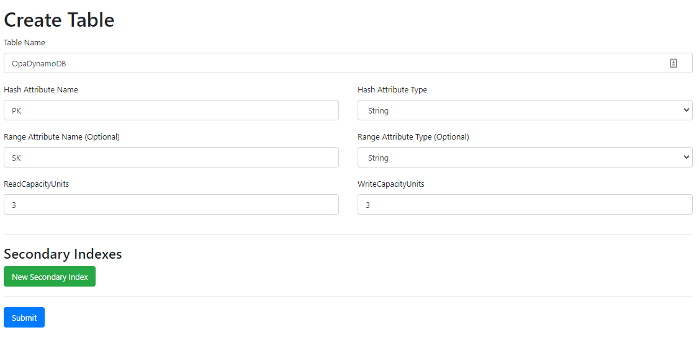

# Quick Start

Prerequisites

 - Docker w/ Docker Compose

The fastest way to get started is with Docker and Docker Compose. You can run OPA and Dynamo DB on your own machine. Create a new folder to copy files into.

Start by creating a new rego file for a policy. Create a file named `rbac.rego` with the following contents to create an RBAC policy:

[filename](examples/rbac.rego ':include :type=code')

Create a new file named `docker-compose.yml` and add the following contents:

[filename](examples/docker-compose.yml ':include :type=code')

Run the docker images with `docker-compose up -d`. This compose file will start the opa-dynamo server, a dynamodb local instance, and a [dynamodb-admin instance](https://github.com/aaronshaf/dynamodb-admin).

You should see the 3 services start. Now you can open a browser to [http://localhost:8001](http://localhost:8001) and use the DynamoDB Admin interface.

!> **WSL2 Users** may need to open on on the ipv6 address [http://[::1]:8001/](http://[::1]:8001/). See [this issue](https://github.com/microsoft/WSL/issues/4983) for more information

?> _DynamoDB Admin_ is a GUI for exporing Dynamo data locally. It's not necessary to use this but it makes this example easier.

Using the GUI, create a new table named `OpaDynamoDB`. This is the name of our table configured in the compose file. Set the Hash attribute to `PK` and the Range attribute to `SK`.



Edit the table and add a policy to evaluate with our rego. Click create item and add two users with their roles:

?> You have to add items individually right now in the GUI. So create one user, then repeat the process to create the next user.

```json
{
    "PK": "foo/bar",
    "SK": "alice",
    "roles": ["engineering", "webdev"]
}
```
```json
{
    "PK": "foo/bar",
    "SK": "bob",
    "roles": ["hr"]
}
```

Up to this point you have:

 - Defined a RBAC policy file
 - Started a local DynamoDB Database
 - Started OPA DynamoDB and connected to the database
 - Filled the database with policy information

Now you can query OPA to evaluate your policy file. The following query will check if user bob has the ability to read data on server123.

```sh
curl -X POST http://localhost:8181/v1/data/rbac/allow \
	-H "Content-Type: application/json" \
	--data '{"input":{"namespace":"foo/bar","principal":"bob","action":"read","object":"server123"}}'
```

You should receive a response similar to:

```json
{"decision_id":"648eccb3-5d8b-4001-8a7a-9e87014ea36a","result":false}
```

Try changing the principal to alice instead and the result will be true.
